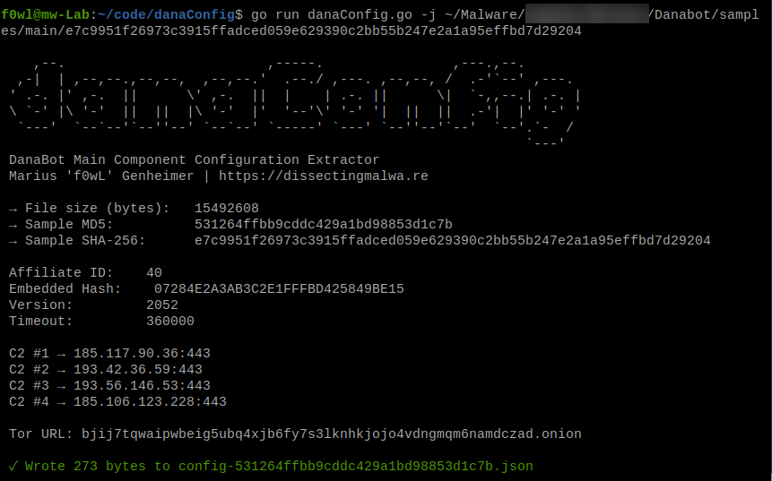
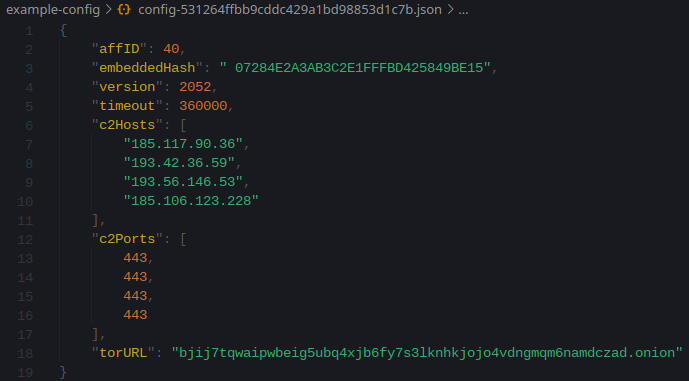
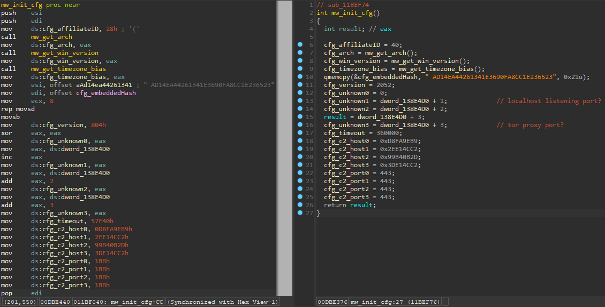
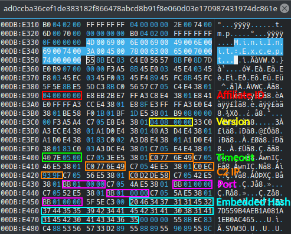

[](https://goreportcard.com/report/github.com/f0wl/danaconfig)

# danaConfig

DanaConfig is a static configuration extractor implemented in Golang for the main component of DanaBot (targeting Microsoft Windows). By default the script will print the extracted information to stdout. It is also capable of dumping the malware configuration to disk as a JSON file with the ```-j``` flag.

### Usage 

```shell
go run danaConfig.go [-j] path/to/danabot_main.dll
```

### Screenshots

The script itself, running in verbose mode and with JSON output enabled:

<p align="center">

</p>


A JSON file with the extracted configuration:

<p align="center">

</p>

## Sources/Credits

The idea of this config extractor is based on the work of Dennis Schwarz, who analyzed the recent spike in DanaBot activity in this [article](https://www.zscaler.com/blogs/security-research/spike-danabot-malware-activity) for Zscaler.

## Configuration layout/contents

Below you can see the configuration structure in IDA Pro:



To visualize the approach of danaConfig I annotated the raw contents of the DLL file in an Hex Editor:

<p align="center">

</p>


## Testing

This configuration extractor has been tested successfully with the following samples:

|                             SHA-256                              |                     Sample                              |
| :--------------------------------------------------------------: | :-----------------------------------------------------: |
| 77ff83cc49d6c1b71c474a17eeaefad0f0a71df0a938190bf9a9a7e22531c292 | [Malware Bazaar](https://bazaar.abuse.ch/sample/77ff83cc49d6c1b71c474a17eeaefad0f0a71df0a938190bf9a9a7e22531c292/) |
| e7c9951f26973c3915ffadced059e629390c2bb55b247e2a1a95effbd7d29204 | [Malware Bazaar](https://bazaar.abuse.ch/sample/e7c9951f26973c3915ffadced059e629390c2bb55b247e2a1a95effbd7d29204/) |
| ad0ccba36cef1de383182f866478abcd8b91f8e060d03e170987431974dc861e | [Malware Bazaar](https://bazaar.abuse.ch/sample/ad0ccba36cef1de383182f866478abcd8b91f8e060d03e170987431974dc861e/) |

If you encounter an error with danaConfig, please file a bug report via an issue. Contributions are always welcome :)
